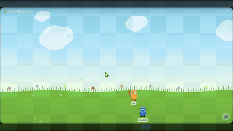

# 🌿 Agent Terrarium

A desktop companion app where AI agents live in a tiny animated world on your screen. Agents wander around, interact with each other, chase balls, wear gear, and chat with you — backed by real AI models or just vibing as NPCs.

<p align="center">
  
</p>

Built with **Tauri v2** (Rust) + **React** (Canvas 2D). All simulation runs in Rust; the frontend is a pure renderer.

## ✨ Features

### Agents
- **10 built-in avatars** — Cat, Copilot, Squirrel, Penguin, Ghost, Clippy, Claude, Chicken Jockey, Fluffy Chicken, and Rubber Duck — each with unique sprites, personalities, and movement styles (wander, patrol, bounce, float)
- **Agent interactions** — agents greet each other with emoji chat bubbles when they meet
- **Hover greetings** — hover over an agent to hear a synthesized "Animalese" voice and see a mood-based emoji
- **Hover slowdown** — agents slow down as your cursor approaches

### AI Chat
- **Chat with agents** — click an agent to open an inline chat bubble; supports Markdown with syntax-highlighted code blocks
- **Pop-out chat** — detach the chat into its own window
- **AI backends** — connect agents to GitHub Copilot, OpenAI-compatible APIs (GPT, Claude, local models), or leave them as echo/NPC bots
- **Per-agent configuration** — set model, system prompt, awareness level, and working directory per agent
- **Text-to-speech** — agents can speak their responses aloud via Windows SAPI with per-avatar pitch shifting

### Awareness System
- **Event awareness** — agents observe terrarium events (balls thrown, other agents arriving, social interactions) and react autonomously with speech, emotes, or movement
- **4 awareness levels** — from chat-only (level 0) to full world-state awareness (level 3)
- **Tool use** — aware agents can `say`, `emote`, `move_to`, or `run_away` in response to events

### Ball Physics
- **Throw a ball** — click and drag to throw; realistic gravity, bounce, wall collision, and friction
- **Agent chase** — agents chase the ball based on their `ballInterest` personality trait
- **Capture & kick** — agents catch the ball and kick it to each other

### Themes & Visuals
- **10 animated themes** — Meadow, Night, Desert, Ocean, Forest, Castle, Outer Space, Seattle, Shanghai, and more — each with unique decorators, particles, and procedural lofi music
- **Dynamic sky** — real-time day/night cycle with sun/moon positioning, dawn/dusk color transitions, and weather overlays (rain, snow, fog, storms) driven by your actual local weather
- **Custom decorators** — themes can include inline SVG elements or external SVG/PNG files with waypoint or parabolic animation paths

### Gear & Accessories
- **10 built-in gear items** — hats, scarves, sunglasses, capes, and more across 5 equipment slots (hat, face, neck, body, back)
- **Equip via context menu** — right-click an agent to dress them up; gear persists across sessions
- **Custom gear** — add your own SVG/PNG accessories via extension packages

### Window & System
- **Always-on-top transparent window** — frameless, resizable, draggable overlay
- **Config persistence** — theme, agents, gear, window position, music, and weather settings saved to `~/agent-terrarium.json`
- **Splash screen** — animated startup screen with `--splash-wait` CLI flag

### Extension Packages
- **Declarative JSON packages** — add themes, avatars, and gear without touching source code
- **User packages** — drop `.json` files into `~/agent-terrarium/packages/` and they load automatically (hot-reload supported)
- **Custom SVG decorators** — themes can reference external art assets
- See the [Extension Authoring Guide](docs/extensions.md) for full details

## 🚀 Getting Started

### Prerequisites

- [Node.js](https://nodejs.org/) ≥ 18
- [pnpm](https://pnpm.io/) ≥ 8
- [Rust](https://rustup.rs/) ≥ 1.94
- Windows 10/11 (primary target)

The GitHub Copilot backend uses the official Rust SDK with its bundled CLI. No Go toolchain or bridge DLL is required.

### Run in development

```bash
git clone https://github.com/asklar/agent-terrarium.git
cd agent-terrarium
pnpm install
pnpm tauri dev
```

### Build an installer

```bash
pnpm tauri build
```

Produces `.msi` and/or `.exe` installers in `src-tauri/target/release/bundle/`.

Backend and Copilot SDK logs are written to `~/agent-terrarium/logs/`.

## 🎮 Controls

| Action | How |
|--------|-----|
| Move window | Drag the title bar |
| Resize window | Drag any edge or corner |
| Chat with agent | Click on an agent |
| Pop out chat | Click the pop-out button in the chat bubble |
| Throw ball | Click and drag on the background |
| Change theme | Right-click → Theme |
| Add/remove agents | Right-click → Add/Remove Agent |
| Equip gear | Right-click an agent → Gear |
| Configure agent AI | Right-click an agent → Configure |
| Toggle dynamic sky | Right-click → Dynamic Weather |
| Debug panel | Right-click → Debug |
| Native context menu | Shift + right-click |
| Dismiss chat | Press Escape |
| Close | Click ✕ in title bar |

## 🎨 Built-in Themes

| Theme | Highlights |
|-------|------------|
| 🌿 Meadow | Green hills, clouds, flowers, falling leaves |
| 🌙 Night | Starry sky, moon, twinkling stars, shooting stars |
| 🏜️ Desert | Orange sunset, cacti, blowing sand |
| 🌊 Ocean | Deep blue, waves, seaweed, animated swordfish |
| 🌅 Forest at Dawn | Misty sunrise, tall trees, fireflies |
| 🏰 Castle | Stone walls, torches, banners, cobblestone |
| 🚀 Outer Space | Nebula, planets, space dust, no ground |
| 🌧️ Seattle | Mt. Rainier, Space Needle, Puget Sound, orcas |
| 🏙️ Shanghai | Pudong skyline, Oriental Pearl Tower, lanterns |
| + more | Paris, Rio, Winter Olympics… |

## 📖 Documentation

| Document | Description |
|----------|-------------|
| [Extension Authoring Guide](docs/extensions.md) | Create custom themes, avatars, and gear packages |
| [Architecture](docs/architecture.md) | Technical deep-dive: simulation engine, IPC, rendering pipeline |
| [Contributing](CONTRIBUTING.md) | Dev setup, code style, how to add themes/agents/backends, PR process |

## 📄 License

MIT
